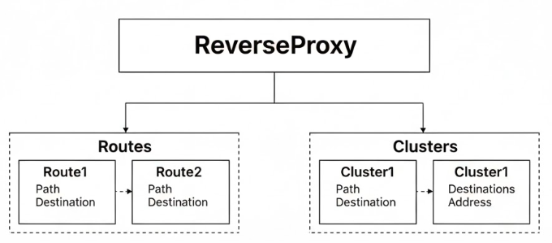

# API Gateway ve Load Balancing Teknolojileri

## Ocelot :

.net Core projelerinde Ocelot, mikroservis mimarisinde yaygın olarak kullanılan open-source bir API Gateway kütüphanesidir.Ocelot temel olarak aşağıdaki hizmetleri sağlamaktadır.

- Request Routing : Gelen HTTP isteklerini belirli kurallar çerçevesinde uygun mikroservislere yönlendirir.
- Load Balancing : Gelen isteklerin yükünü birden fazla mikroservis instance’ı arasında dağıtarak servislerin dengeli bir şekilde çalışmasını sağlayabilir.
- Service Discovery : Mikroservislerin yerlerini dinamik olarak keşfederve yönlendirmeyi güncel tutar. Consul , Eureka vs. gibi servis discovery araçlarıyla entegre çalışabilir.
- Authentication : JWT veya başka k,mlik doğrulama yöntemlerini kullanarak kimlik doğrulayabilir.

Ocelot yapılandırılmasında bazı önemli terimler ;

- Downstream Path Template : Yönlendirme yapılacak mikroservis’in route’sini tutmaktadır.
- Downstream Scheme : İlgili mikroservise yapılacak isteğin hangi protokol üzerinden gerçekleştirileceğini bildirmektedir.
- Downstream Host and Ports : Mikroservis’in host ve port bilgilerini tutmaktadır.
- Upstream Path Template : API Gateway üzerinden mikroservise yapılacak yönlendirmenin template’ini tutmaktadır. Bu template ile API Gateway’a gelen istekler DOwnstreamPath Template’deki route’ye yönlendirilecektir.
- Upstream Http Method : Hangi isteklerin yapılabileceği bildirilmektedir.

## YARP :

YARP(Yet Another Reverse Proxy) Microsoft tarafından geliştirilen open source bir API Gateway ve reverse proxy kütüphanesidir.

YARP’ı kullanabilmek için Yarp.ReverseProxy kütüphanesinin uygulamaya yüklenmesi ve aşağıdaki gibi yapılandırılması gerekmektedir.

```csharp
var builder = WebApplication.CreateBuilder(args);

builder.Services.AddReverseProxy()
    .LoadFromConfig(builder.Configuration.GetSection("ReverseProxy"));

var app = builder.Build();

app.MapReverseProxy();

app.Run();
```

Burada görüldüğü üzere AddReverseProxy metoduyla YARP için gerekli servisi uygulamaya ekliyor, MapReverseProxy middleware’i ile de reverse proxy özelliğini uygulamada aktifleştiriyoruz.Ayrıca LoadFromConfig metodundan da anlaşılacağı üzere YARP’ı appsettings.json üzerinden yapılandırıyoruz.

Tabi bunun dışında bir de runtime da yapılandırmada bulunabilirz ,bu yapılandırma için kullanacağımız şablon aşağıdaki görseldeki gibi olacak.Resimde de görüldüğü üzere YARP’ın yapılandırması Clusters ve Routes temelinde şekillenmiştir.



Clusters ile reverse proxy tarafından yönlendirilen isteklerin hedeflerini belirleyebilmek için birden fazla hedef sunucu veya hizmet gruplandırılmaktadır. Mesela bir uygulamadaki farklı yükseklikteki sunucuları veya servisleri bir küme olarak tanımlayabiliriz. Her bir cluster, içerisinde hedef sunucunun ya da servisin adresini belirten destination barındırmaktadır ve bunların sayısı bir veya birden fazla olabilmektedir. Böylece istekler belirli br küme içindeki farklı hedeflere yönlendirilebilir, bu da hedef sunucularda çeşitlilik sunabileceği gibi load balancing vs. gibi imkanlarda ekstradan avantajlar sağlayabilmektedir.

Routes ise isteklerin reverse proxy tarafından yönlendirilmesinin hangi kurala, cluster’a ve hedefe göre yönlendirileceği tanımlarını barındırır.

### NGINX :

Yüksek performanslı ve hafif bir reverse proxydir; Web sunucusu , reverse proxy , load balancer, DDoS saldırılarına karşı rate limiting davranışı sergileyerek güvenlik amaçlı kullanılabilir.

Nginx kurulumu için ‘[https://nginx.org/en/download.html](https://nginx.org/en/download.html)’ adresinden cihazınıza uygun versiyonun indirilmesi gerekmektedir. Kurulum işleminden sonra yandaki görseldeki gibi nginx.exe dosyası üzerinden nginx’i ayağa kaldırabilrisiniz , daha sonrasında da nginx.conf dosyası üzerinden gerekli yapılandırmaların ayarlanması gerekmektedir.

```nix
http {
    upstream backend_servers {
        server backend1.example.com;
        server backend2.example.com;
        server backend3.example.com;
    }

    server {
        listen 80;
        server_name example.com;

        location / {
            proxy_pass http://backend_servers;
            proxy_set_header Host $host;
            proxy_set_header X-Real-IP $remote_addr;
        }
    }
}

```

**1. http { ... }**

Bu bölüm, Nginx’in HTTP trafiğiyle ilgili genel ayarlarını içerir. Proxy, yük dengeleme, önbellekleme veya hız sınırlama gibi yapılandırmalar genellikle bu blok içinde yapılır.

**2. upstream backend_servers { ... }**

Burada, gelen isteklerin yönlendirileceği arka uç (backend) sunucular tanımlanır.

Her `server` satırı, Nginx’in yükü dağıtacağı bir hedef sunucuyu gösterir.

Varsayılan olarak Round Robin yöntemiyle istekler sırayla bu sunuculara dağıtılır.

**3. server { ... }**

Bu kısım, belirli bir web sitesi veya alan adı için yapılandırmayı temsil eder.

Her `server` bloğu kendi alan adına veya IP adresine göre gelen istekleri yönetir.

**4. listen 80;**

Nginx’in hangi port üzerinden gelen istekleri dinleyeceğini belirtir.

Port 80, HTTP trafiği için varsayılan bağlantı noktasıdır.

**5. server_name example.com;**

Bu ayar, yapılandırmanın hangi alan adına gelen istekleri karşılayacağını gösterir.

Örneğin `example.com` adresine gelen istekler bu sunucu bloğu tarafından işlenir.

**6. location / { ... }**

Bu bölüm, belirli bir yol veya dizin için geçerli olacak yönlendirme kurallarını tanımlar.

Buradaki `/`, ana dizini ifade eder; yani siteye gelen tüm istekleri kapsar.

**7. proxy_pass http://backend_servers;**

Gelen istekleri `upstream` kısmında tanımlanan arka uç sunuculara iletir.

Bu şekilde Nginx bir reverse proxy görevi üstlenmiş olur.

**8. proxy_set_header ...**

İsteklerin yönlendirilmesi sırasında bazı ek başlık bilgileri eklenir.

`Host $host;` orijinal alan adını korur,

`X-Real-IP $remote_addr;` ise istemcinin gerçek IP adresini arka uç sunucusuna iletir.
